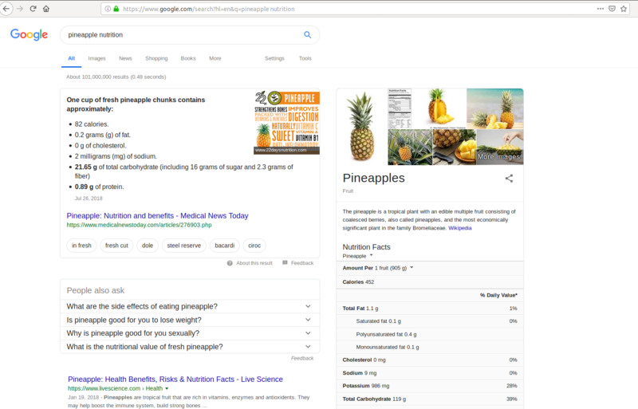

# Arguments for food intake management

**Note:** I hold *no verifiable credentials* to advise you on this kind of work at the time of writing this

## The Question

The lack of education pointed to in the sentences that follow is specifically in relation to food. I start this article with the questions I always had and those that I started with.

How much of my learning about nutrition rom school am I applying to my daily life? We keep reading about new research findings in relation to foods and diet related diseases and yet many of us do not consider *managing* our food any important. Instead we tend to go with "sensation". I want to take a balanced and thoughtful approach to managing what I put into me.

[Insert a picture of south beach diet, lemon water diet, avocado diet etc. grouped together here]

"If these diets do work, what basic elements of them make them work?" It can't be magic. Can it be? Pineapple diet? I have nothing against pineapple. But eating solely pineapple? What are the arguments that the proponents make?

A simple Google search for nutritional content of a pine apple turns up results

Now how many pineapples does one have to eat in a day to provide for what one's body needs? Does that provide sufficient amount of all micro and micro nutrients? If I find out that it does, good for me! I would then have a strong argument that this **diet** is the best (or at least that it is *sustainable*). I would always welcome such a *complete argument*.

You find the number don't match? Hmm... atleast one of these must be wrong:

1. Pineapple is a well-rounded food for human body
2. Nutrient information of pine apple you obtained is reliable
   2.1. The findings of researchers who evaluated the nutritional content of pine apple are reliable

Does such an analysis feel tough to me? Not in these times when I have all the information I require at my disposal.

    Apply critical thinking.
    Examine your base facts.
    Avoid relying on sensational claims.
    Question the unadvertised aspects of a claim and process.

It is advisable that one doesn'tt get convinced with the attractive pictures the so called "followers" paint of the results after adopting it. They may be doing more (workouts, regular routine etc.) in addition to following this diet. Since you will be missing those *additional steps* (your day job might be different than their career), you mayn't be getting the benefits they advertise.

## How to look at logging food?

I see tracking (or logging) what I eat to be my *continuing education* activity.

We all are born - We pick up our eating habits from what our family follows - We adapt to what we know the people residing around eat -
Yet as an *uneducated* individual, we don't know whether what we eat is enough and what we eat properly feeds what we are.
To get better at understanding our own needs, we need to track since tracking makes it easy to manage.

If you are considering logging yourself, these simple tools can get you started:

* a paper (book)/spreadsheet for noting down the food eaten
* A quick web search at the end of day, to learn nutrition obtained over the day

 This way, you can understand what you ate, compare it against nutrtional recommendations for your age obtained from your local health organization (Governmental or otherwise) and plan for the next. You may choose to do the research and planning during weekend using the data collected over the days of previous week.

I personally am using [MyFitnessPal](https://www.myfitnesspal.com/) at this time.  Their mobile app that lets me scan a product and automatically populate its nutritional information in my daily log is less frictional to my daily activities. You may use open source products with support for barcode scanners available voer the Internet or even build your own! If you do do, heyy, send me a note to start using it!
