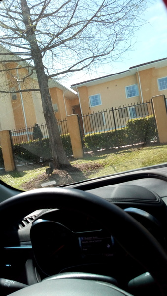
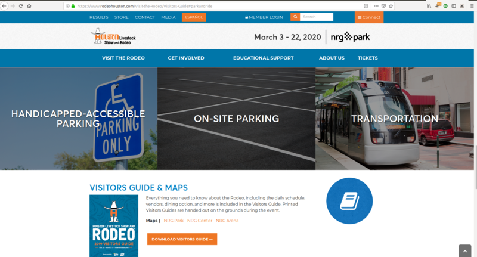
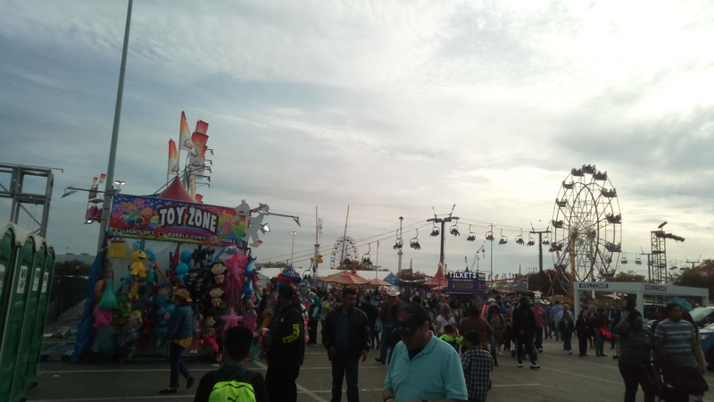
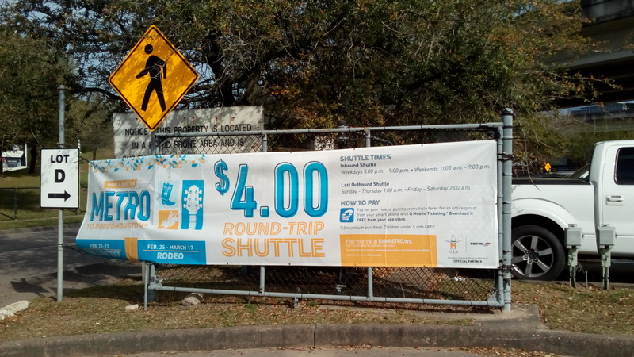
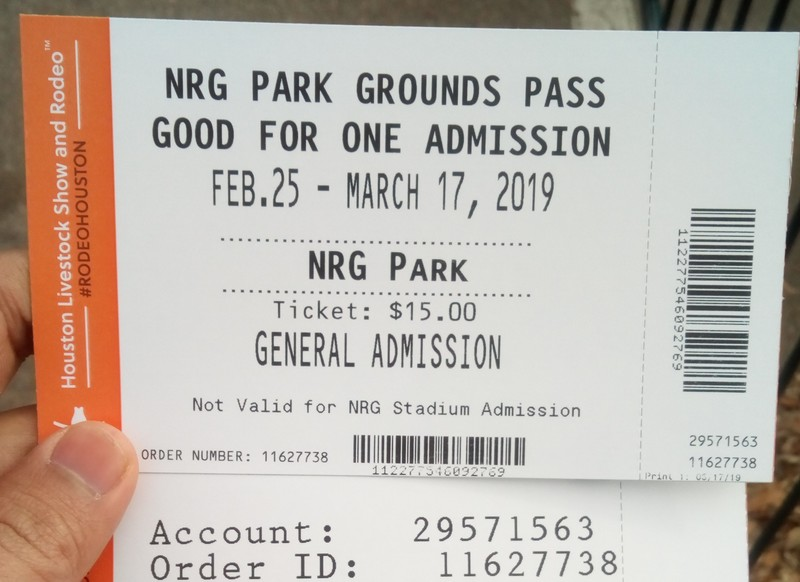
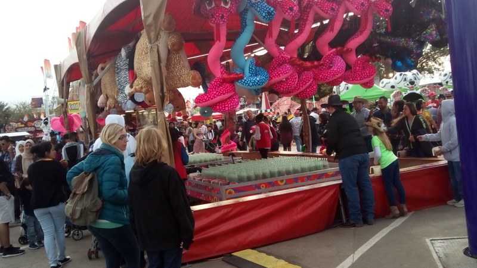
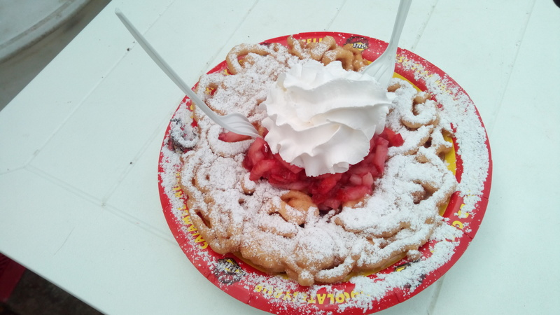

# Being in Houston while Rodeo is in town

Well, what else? The logical step is to be at the Rodeo then!

## Getting there:

Driving to Rodeo started good, went a bit haywire and ended smooth!

The location was NRG Park. Navigation instructions sometimes showed the destination as 'NRG Grounds'.
That being my first time in Texas, the logistics part was indeed a bit troubling.
I could drive but parking is always a hassle. Pay unimaginable amount for a parking spot or take a public transport option? I was warned beforehand by my Texan colleagues that the public transportation in Houston is not as good as it can be. I heard reaching Downtown from other major spots of city is not direct and so on.
One has to dig into the rodeohouston.com website and look into the "Vistor's guide" (a downloadable PDF it is!) for instructions on parking. Lucky me! There are park-n-ride facilities.

I set my navigation direct to the *West Loop* lot for its free parking and affordable round-trip pricing of shuttle. Driving over the 6-lane wide I-45 South made Google Maps go mad. First, there was its mislocating me to be on the freeway adjacent to I-45 S and constant instruction to take left to get into I-45S. This nagging repeated itself almost every 2 miles! Since I memorized to an extent, the initial directions and exits to take, I persisted driving until I reached the right exit. Later, I proceeded onto I-610 E instead of I-610 W as the Maps got stuck in trying to reroute me (for no fault of mine, phew!). This added nearly 17 more min. to my journey!

As to expect from such an attractive free and cheap ride option - West Loop, once I was there, the primary lot the Maps app pointed to was completely filled. This is where reading directions beforehand helped again. I knew I reached the right location and then had to ignore the voice navigation instructions to see that there are in fact 4 lots in an interesection fashion. I found good no. of spots in Lot D. Off into the shuttle in the opposite Lot D!

## At Rodeo:

Choosing to buy tickets for Rodeo was again a challenge. To start with, the website just had 2 options preventing any potential confusion but it was just me trying to weigh them both against each other. The Rodeo all-access pass is \$15 and the plain NRG grounds-only access was \$5 allowing me to go around just the carnival but not the actual Rodeo show. So going for the cheaper option would prevent me from experiencing the actual Rodeo. Isn't it? The catch here is that *the Rodeo* and concert were bundled together and I am not interested in attending the concert. So it felt like going for the all-access pass would be a waste for me. It is unclear too if both the concert and Rodeo happen all day/happen in turns or otherwise

So I just postponed the idea untl I get to a physical counter. You can buy the tickets online beforehand too. That way you would avoid the situation I describe next.

Once I arrived at the ticket booth, I learned that the day's tickets for *the Rodeo show* were gone. So I had only way to get-in and I went for that NRG Grounds-only option. Boy, did I have a good time! My first funnel cake!

The organization of the carnival was good. Games, rides, food stalls and a lot of activities kept me engaged for about two and half hours. If you are ever going to be in Houston around this February-March period, you may plan to attend the event yourself! Look at the event's website for pre-booking tickets to main Rodeo event and parking/other transport instructions.