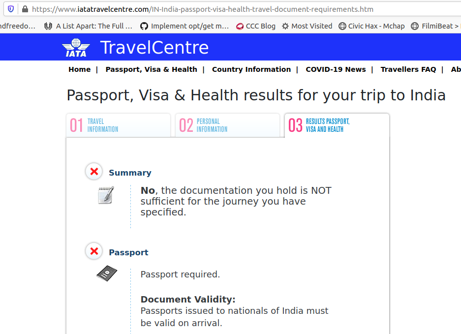

# Can you travel to your home country with an expired passport?

## Hypothesis

Being a citizen of a country, one should be allowed to enter the country from outside regardless of the *currentess* (or *currency*) of travel documents

## Data Collection

1. The following chat with representative of Emirates Airlines, a well-known international carrier provided direct links to existing body of knowledge. The chat transcript is edited for brevity:

    *Note:* In this case, the home country under investigation is *India*
    >
    >...
    >
    >Shashank: I have a question related to traveling with expired passport.
    >
    >...
    >
    >Can I travel to my home country even if my passport expired earlier to the expected date of entry?
    >
    >...
    >
    >Agent: I've checked on this
    >
    >...
    >
    >Your passport should be valid on arrival.
    >
    >You must travel before your passport expiry as per instruction by local authorities in India
    >
    >You can use [this link](https://www.iatatravelcentre.com/?_sm_au_=iVVSsR6stFWTWQ7rJf17vK0T8QQJ4) to help you as well
    >
    >Shashank: Thanks [Agent] for the website. I'll check it.
    >
    >When you said "...as per instruction by local authorities in India ", did you mean I won't be allowed to India in the case I described?
    >
    >Agent: Yes, in that case, you won't be able to board the flight
    >
    >Is there anything else I may help you with?
    >
    >Shashank: Cool. That's exactly what I needed to know today. Thank you very much for the information [Agent].
    >
    >Agent: You’re welcome, Shashank. Stay safe! Thank you for contacting Emirates, Have a nice day. Take care!

2. As reported by [official portal of IATA](https://www.iatatravelcentre.com/IN-India-passport-visa-health-travel-document-requirements.htm), *Passports issued to nationals of India must be valid on arrival*
3. As noted by an unofficial responder [here](https://travel.stackexchange.com/questions/111313/entering-your-home-country-with-expired-passport#comment270238_111313), Polish constitution and Passport Acts appear to have provisions to allow entry in such cases
4. A [broad observation](https://travel.stackexchange.com/questions/111313/entering-your-home-country-with-expired-passport#comment270368_111313) that more than the *home country*, a *carrier* to the country itself can object to allowing travel in such cases is being drawn from unofficial responses to the question in point 2 above as well as from the *chat transcript* mentioned in point 1 above

## Observations

1. Each country has its own rules for allowing entry to even known citizens. At best, one can start with [IATA's system](https://www.iatatravelcentre.com/?_sm_au_=iVVSsR6stFWTWQ7rJf17vK0T8QQJ4)
2. Before making any travel plans one can seek assistance from a reputed flight carrier or directly the embassy/passport control of home country
3. [Timatic](https://en.wikipedia.org/wiki/Timatic) as indicated  response in [Point 2 of *Data Collection*](#data-collection), is a database containing documentation requirements for passengers traveling internationally via air, e.g. passport and visa requirements
4. The burden of handling a passenger whose entry at a destination is denied by immigration authorities appears to be on the *carrier* as per notes in [Wikipedia page of Timatic](https://en.wikipedia.org/wiki/Timatic)

## Conclusion

The hypothesis turns out to be *false* for the case of India and *true* for the case of Poland

## Suggestions for Future Work

A process similar to the one outlined in the [Data Collection](#data-collection) section above can be carried out to determine conditions affecting re-entry into countries other than India and Poland
