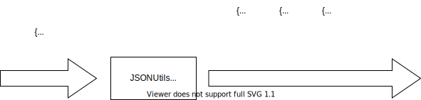

# Contributing JSONUtils.getExpandedJSON() to org.json on Github

Suppose we have a JSONObject with arrays inside

To split(_expand_) it into a `List` of JSONObjects where each is in its simplest model `{key: value}`, you may use

Note that non-array elements get copied as-is
