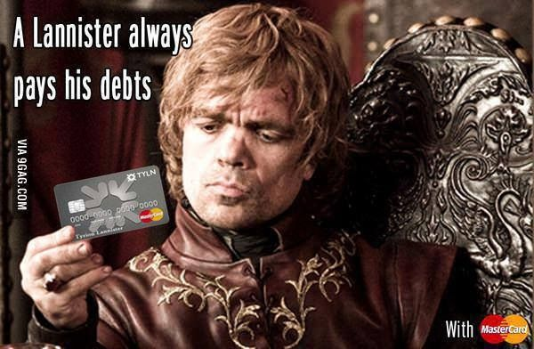

# Pay Your Shared Expenses Proactively (Financials Series Part - 1)

Have you been using [Splitwise][1] ([Here][2]'s the download link) or a similar expense-sharing app for letting your friends pay for your expenses and settle later? I hear you. We always pay our debts

[Attribution]( https://www.pinterest.com/pin/325314773054293188/)

## Issue:

But, how can one make sure that expenses are recorded in personal ledgers immediately when they happen or at the end of that day but... (see next)

## Cause:

 ...the friends/family that *actually paid* have different timelines for entering the expense specifics in Splitwise (or another expense-sharing app)?

## Resolution:*

Pay proactively.

1. When you are physically present during the purchase, use your *consciousness*. Make a mental note/piece of paper/mobile phone to record the expense
    While in checkout lane/in the break you get during transportation back to next destination, transfer the amount digitally and record the payment in Splitwise.

    Yes! Until now, you might have been using Splitwise as a 'settlement' enabler but how about using it in this new 'prepayment' enabler model? Note that, this doesn't change *how* you pay, only *when* you pay to get your finances right (by the time of expense occurrence)

2. If you are not physically present during purchase (or pay your part of a shared bill handled by friends/family), use *previous payment records* and pay the maximum you expect it to cost you. You can adjust this amount down over time, if you are continuously seeing bigger refunds (What? [you enjoy refunds?](https://www.wnd.com/2019/02/your-tax-refund-is-less-thats-a-good-thing/)) or even up.

Are you specific on paying your part of taxes too? Someone is not living in [Pennsylvania]([3] if groceries alone are being considered ;). Make it simple for yourself by expecting to pay/carry-over minor amounts at the end. Over time, you can manage this well too.

Does it seem tough at the first sight? I hols that the conviction to adopt financial discipline necessitates this. This is similar to tracking your food intake, workouts etc. More on those in future posts

So, in short --

    Pay early. Make everyone happy. (Remember, "everyone" always includes "you")

[1]: https://www.quora.com/What-is-the-business-model-of-splitwise
[2]: https://www.splitwise.com/
[3]: https://www.pacode.com/secure/data/061/chapter60/s60.7.html
