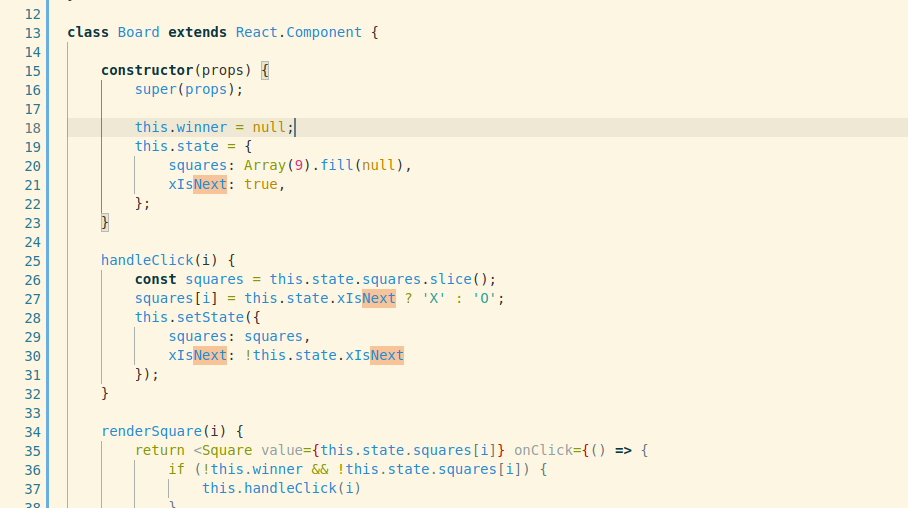

# React for Engineers Series - Part 1

My learning always starts from the first [Tutorial](https://reactjs.org/tutorial/tutorial.html)/Guide/Introduction of the library/framework/language author(s). Get started [here](https://reactjs.org/docs/getting-started.html)

This is a record of observations and enhancements that crossed my mind as I went through:

## 1. Unit Testing

React Components are either 'classes' or 'functions'. I like how individual pieces of an app are modeled as components (`Square` makes up `Board` which then makes up `Game`). This is very welcoming to build unit tests around.

## 2. Class Variables

The [Declaring a Winner section](https://reactjs.org/tutorial/tutorial.html#declaring-a-winner) invokes same function `calculateWinner()` inside 2 different methods (of same class though). For an optimal experience, we should be able to assign the result of this function to a variable. Yet having class variables [doesn't seem](http://www.jimlynchcodes.com/blog/dont-forget-about-class-variables-in-react) to be a thing.

Instead one can declare any the such variables inside `constructor()` and then proceed to access it in functions via `this`

## 3. React bets a lot on immutability

The [History of moves](https://reactjs.org/tutorial/tutorial.html#storing-a-history-of-moves) section again calls out on the importance of *immutability*. I stop to wonder how other frameworks (Angular etc.) and non-framework workflow adopters would approach this `Undo` problem!

In particular [this 'Advanced' section](https://reactjs.org/docs/optimizing-performance.html#examples) goes over the power of not mutating data, so one can use React's `PureComponent` provision. At the end, some external helpers that help one stick to immutability in complex datastructures are provided.

Coming back to the Tic-Tac-Toe game example app, the `Board` at any given time has only a single state. For us to be able to navigate back to older states, the approach described in the [History of moves](https://reactjs.org/tutorial/tutorial.html#storing-a-history-of-moves) section is that a component at an even higher level (i.e. `Game`) would store the history of *states* of Board in its own member array.

## 4. The 'lists' and their 'keys'

For React to keep track of state changes of a list, since the lists can be modified in many ways, every item inside should have a key. Do not let index be the key (default)
