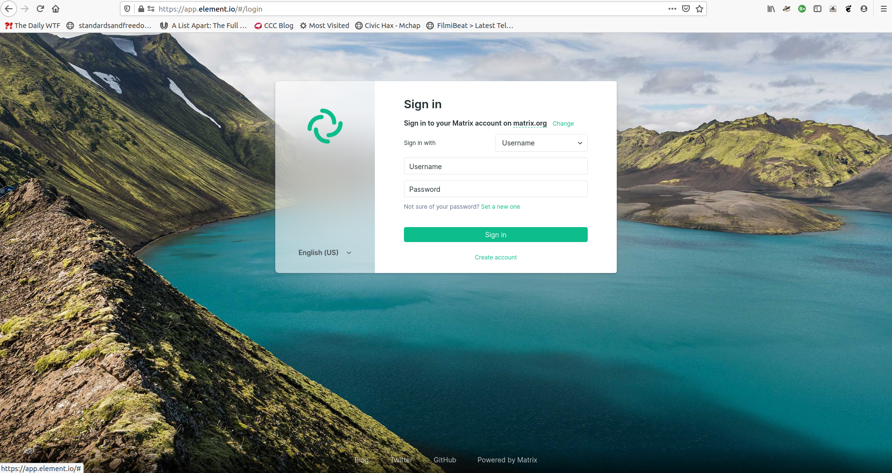

# Setting up Matrix Server for Community Learning Project (Part 1)

## What?

Think of Slack. Think of Discord. This is a real-time communication forum enabling our continued learning.
The *difference*: we are in control of our data

## Why?

[Virtual](https://www.carnegielibrary.org/event/virtual-on-ramp-to-python-a-six-week-introduction-to-coding-2/) or otherwise, interested learners got together for 6 weeks to learn and practice Python programming language for more than 2 years. At the end of every offering, our participants asked: *What's next?*, *Is there a Level-2*?

We now launch this platform so our alumni and alumni-to-be can get together to enhance their learning. Learning is an ongoing journey and our goal is to extend the path we laid.

## Where?

Our server is hosted at <https://chat.fossterer.com>
To join the community and login later, proceed to [How do I](##how-do-i) guides

## Who?

We are the staff of Carnegie library of Pittsburgh and volunteering facilitators associated with program **On Ramp to Python: A Six Week Introduction to Coding**

## How do I..?

### Register

- If you are a *facilitator* or are *accepted* for the program, watch out for a *second* email that comes with an invite link and instructions
- If you are an alumnus, we are *working* on the best way to reach you soon
- Python or otherwise, if you are eager to learn or advise others in community about programming, just *ask* nicely to join
  - [Open an Issue](https://github.com/fossterer/fossterer.github.io/issues) (*Preferred*) or [Tweet to me](https://twitter.com/SVRSN_Shashank)

### Login

We can guide you using this [web app](https://app.element.io):

- Click on *change* at the top left inside Login box

- Modify 'Homeserver URL' contents to <https://chat.fossterer.com> and click 'Next'

- You can choose to 'Skip' the key setup safely for the purposes of this program

You  have more *choices* such as [this](https://matrix.org/clients) and sophisticated setups such as [this](https://matrix.org/bridges/)

## Privacy Policy

1. We don't associate your *email address* with your account on this server. [Yayy! Matrix](https://matrix.org/faq/)
   1. Unless you wish to use the *Forgot Password* feature
      1. We do not use it for any other purposes
2. We won't have anything to do with *your data*
   1. In fact, you may participate in our *community* by [hosting](https://matrix.org/faq/#self-hosting) your data on your own server
      1. Yes, we welcome you that way too!
3. Anything else you are concerned about? Please ask. We care about privacy and responsibility too
