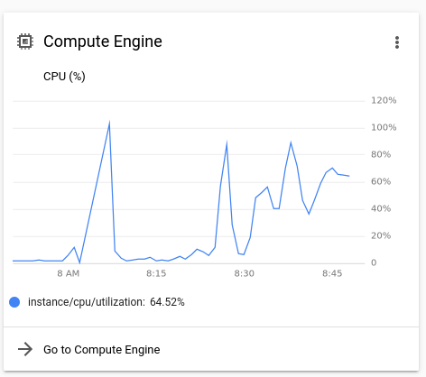
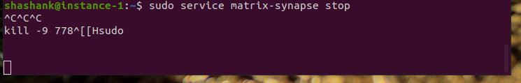

# Setting up Matrix Server for Community Learning Project (Part 2)

Between [Dec 19 2020](setting-up-matrix-server-for-community-learning-part-1.md) and today *i.e.* Dec 23 2020, I tested the [matrix-synapse homeserver](https://github.com/matrix-org/synapse) setup in various configurations:

- Registering a non-admin user to communicate with (Without a private key and with one)
- Logging in as another user to create groups (Allowed)
- Logging in as another user to attempt creating communities (Turned off by default)
- Turning on [federation](https://github.com/matrix-org/synapse/blob/develop/docs/federate.md)
- Logging in as another user to join public communities on another homeserver

## Blockers

As soon as I joined a public community (on a different homeserver) with lot of messages (*events* as Matrix would refer to it), the process of synchronizing (Scroll to [How does it Work](https://matrix.org/)) consumed too many resources on my server that I had to forcefully restart it

My SSH session went unreponsive. You can see my keypresses attempting to exit the session

## Decision Time

While I have in-place a flow for [registration approval](https://github.com/ZerataX/matrix-registration) and the desired *Terms and Conditions* acceptance and tracking is [possible today](https://matrix.org/docs/guides/moderation#enforcing-server-terms-of-use), for the reasons listed below, I am making a change in the direction of this project:

1. I cannot prevent users registering on my homeserver from joining other public communities at their will. The reasons are both
   - *Technical* - While *federation* is enabled, the Synapse server implementation today does not provide a way to prevent (non-admin/admin) users from joining public communities and
   - *Intentional* - While the matrix protocol today provides for implementing an "Access Control List" of other homeservers that can be whitelisted, I do not believe it to be in the best interests of members in this [On-Ramp To Python](https://www.carnegielibrary.org/event/virtual-on-ramp-to-python-a-six-week-introduction-to-coding-2/) and other friends to be prevented from engaging with larger communities to advance their learning

2. My current budget allocation for this project has to be increased at least by 5 times to run a large enough server that staisifes the goals of this project - to be an accommodating learning platform where our data is in our control

## So?

To hit all the goals stated above, I will be

- creating the intended Invite-Only/Public community on the [hosted](https://matrix.org/blog/2018/05/29/matrix-org-homeserver-privacy-policy-and-terms-of-use-being-enforced-today) and open matrix.org homeserver and
- [donating](https://matrix.org/blog/2019/06/11/introducing-matrix-1-0-and-the-matrix-org-foundation#and-finally) my planned budget directly to that project for the greater good of [advancing decentralization standards](https://matrix.org/blog/2020/10/19/combating-abuse-in-matrix-without-backdoors)
- [contributing](https://github.com/matrix-org/synapse/pull/8987/files) to the codebase and spec in crucial server administration and management areas

For help with server provisioning and user provisioning, you can always send me a [Direct Message](https://twitter.com/SVRSN_Shashank) on Twitter or [Open an Issue](https://github.com/fossterer/fossterer.github.io/issues) on Github.
