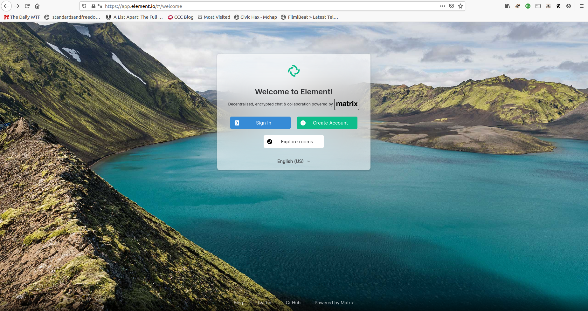
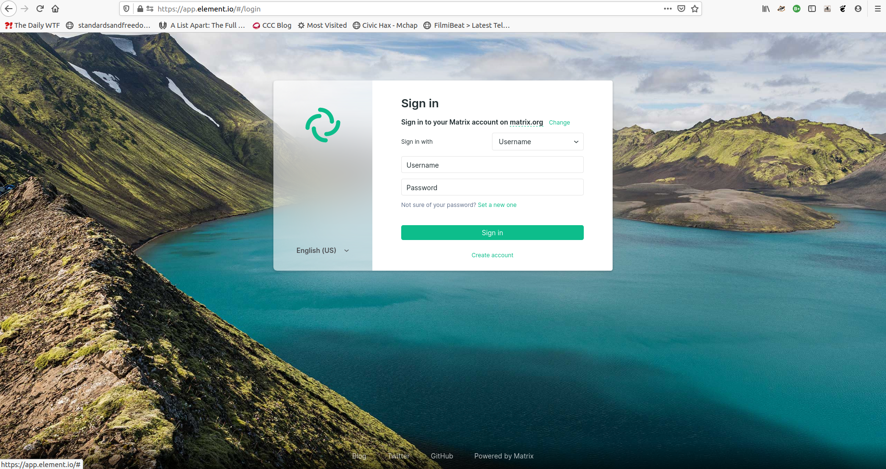

# Setting up Matrix Server for Community Learning Project (Part 3)

## What?

Think of Slack. Think of Discord. This is a real-time communication forum enabling our continued learning.
The *difference*: we are in control of our data

## Why?

[Virtual](https://www.carnegielibrary.org/event/virtual-on-ramp-to-python-a-six-week-introduction-to-coding-2/) or otherwise, interested learners got together for 6 weeks to learn and practice Python programming language for more than 2 years. At the end of every offering, our participants asked: *What's next?*, *Is there a Level-2*?

We now launch this platform so our alumni and alumni-to-be can get together to enhance their learning. Learning is an ongoing journey and our goal is to extend the path we laid.

## Where?

We use the public server hosted by matrix.org
To join the community and login thereafter, proceed to [How do I](##how-do-i) guides

## Who?

We are the staff of Carnegie library of Pittsburgh and volunteering facilitators associated with program **On Ramp to Python: A Six Week Introduction to Coding**

## How do I..?

### Register/Login

- If you are an alumnus, we are *working* on the best way to reach you soon. Alternatively, see next
- Python or otherwise, if you are eager to learn or advise others in community about programming, just *ask* nicely to join
  - [Open an Issue](https://github.com/fossterer/fossterer.github.io/issues) (*Preferred*) or [Tweet to me](https://twitter.com/SVRSN_Shashank)

We can guide you using this [web app](https://app.element.io):

#### Step-1

- Choose *Create account* or *Sign in*

- You can choose to 'Skip' the key setup safely for the purposes of this program
  - If you wish to send private encrypted chats with your peers or new friends, you would have to setup and backup this *encrypted key*

You  have more *choices* such as [this](https://matrix.org/clients) and sophisticated setups such as [this](https://matrix.org/bridges/) too!

By this point, you would be having a userid

#### Step-2

In one of your program-related emails, you'd find my email ID.
Send your user id to it to receive an invite to your account.
The invite does not come to your email ID

#### Step-3

The next time you login into your Matrix client (Element or otherwise), you would see an 'Invitation to join'.
Accept it to start participating in our community!

*TODO:* Image required

Thereafter, you can find multiple rooms related to Python, programming in general and everything else to join

## Self-hosted servers

1. You may participate in our *community* by [hosting](https://matrix.org/faq/#self-hosting) your data on your own server after accepting our *Terms and Conditions*. Yes, we welcome you that way too! For instructions, please see the section [Who?](#Who?)