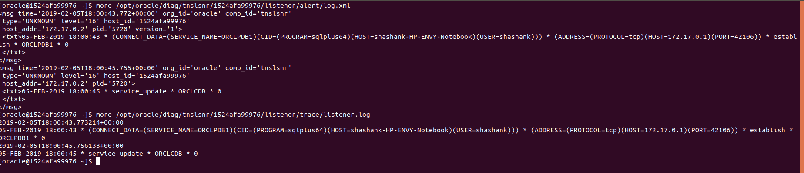
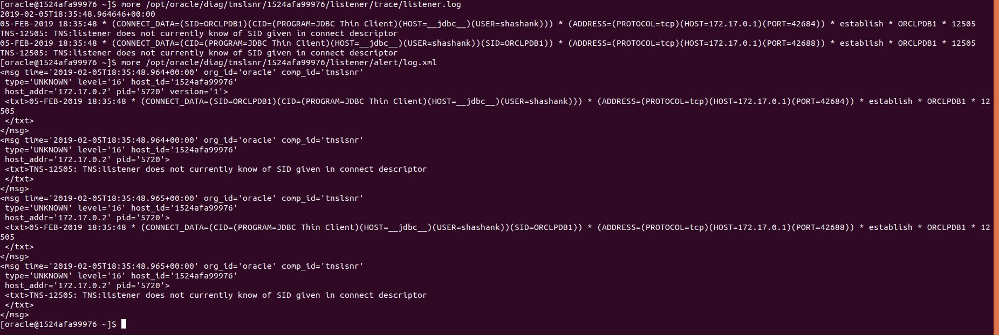
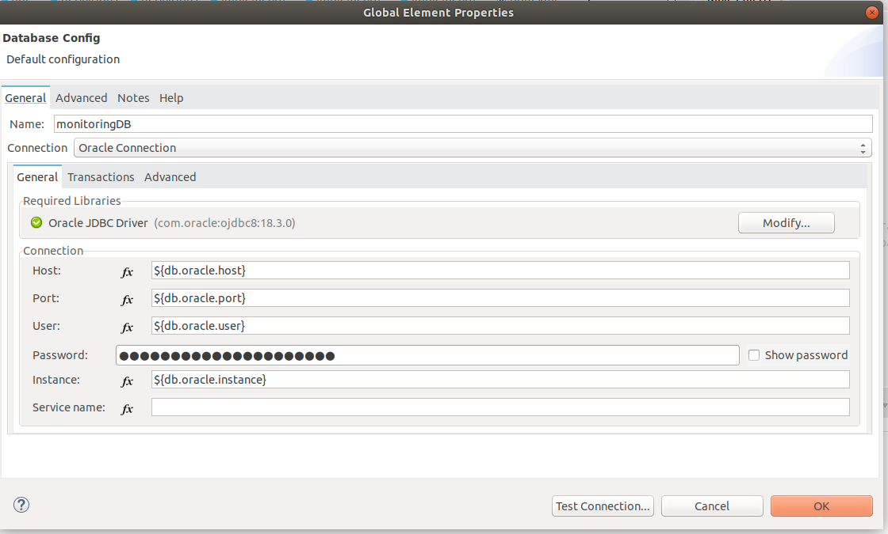
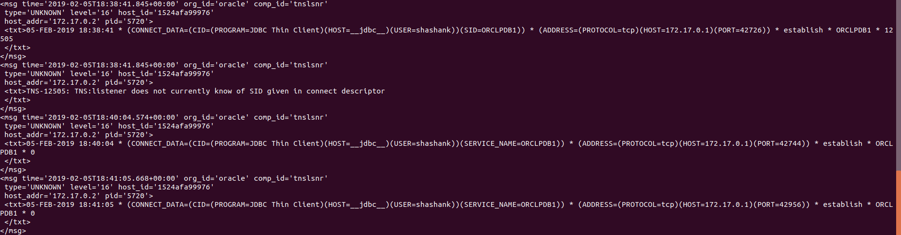
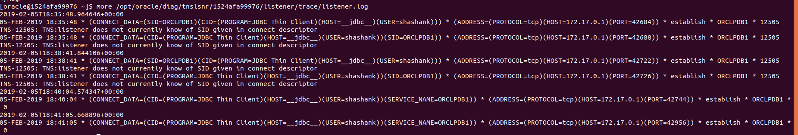

# Troubleshooting ORA-12505 TNS:listener does not currently know of SID given in connect descriptor

## Background

I was working on adding *backend flexibility* capability to an otherwise H2-backed application developed in Mule 3 when the request to move it to Mule 4 came up. The user would be able to configure the application to run with any of the 6 database backends supported by altering a simple string parameter (property).

As it has already been established, Mule 4 is vastly different from its predecessors and in a way, Mulesoft Inc. [itself advises][1] rebuilding projects in Mule 4 instead of struggling to port until their 3-to-4 migration tool is made available. In this new incarnation of the app, I decided to start with MySql support first, add Oracle then and proceed to support other backends later.

## Issue

Configuring connection to MySql was simple. All required properties were filled in the relevant Database connection module of Mule 4 similar to what was done while using Mule 3.

Oracle connection configuration done in a manner similar to what I did while running on Mule 3 started showing weird failures after successfully configuring the JDBC driver:

```sql
ORA-12505 TNS:listener does not currently know of SID given in connect descriptor
```

I could still connect to the same Oracle database using [official SQLPLUS64 client][2]. Still I could connect to it from my old Mule 3 app.
A hint from our boss to confirm that the SIDs being used are correct and that appropriate listeners are running led me go down a deep rabbit hole:

`lsnrctl start` and `lsnrctl status` to check the behaior of listener in the Docker container running Oracle database hinted at 2 prominent log files

```bash
$ lsnrctl start

LSNRCTL for Linux: Version 18.0.0.0.0 - Production on 05-FEB-2019 17:47:29

Copyright (c) 1991, 2018, Oracle.  All rights reserved.

TNS-01106: Listener using listener name LISTENER has already been started


$ lsnrctl status

LSNRCTL for Linux: Version 18.0.0.0.0 - Production on 05-FEB-2019 17:46:58

Copyright (c) 1991, 2018, Oracle.  All rights reserved.

Connecting to (DESCRIPTION=(ADDRESS=(PROTOCOL=IPC)(KEY=EXTPROC1)))
STATUS of the LISTENER
------------------------
Alias                     LISTENER
Version                   TNSLSNR for Linux: Version 18.0.0.0.0 - Production
Start Date                05-FEB-2019 15:03:48
Uptime                    0 days 2 hr. 43 min. 10 sec
Trace Level               off
Security                  ON: Local OS Authentication
SNMP                      OFF
Listener Parameter File   /opt/oracle/product/18c/dbhome_1/network/admin/listener.ora
Listener Log File         /opt/oracle/diag/tnslsnr/1524afa99976/listener/alert/log.xml
Listening Endpoints Summary...
  (DESCRIPTION=(ADDRESS=(PROTOCOL=ipc)(KEY=EXTPROC1)))
  (DESCRIPTION=(ADDRESS=(PROTOCOL=tcp)(HOST=0.0.0.0)(PORT=1521)))
  (DESCRIPTION=(ADDRESS=(PROTOCOL=tcps)(HOST=1524afa99976)(PORT=5500))(Security=(my_wallet_directory=/opt/oracle/admin/ORCLCDB/xdb_wallet))(Presentation=HTTP)(Session=RAW))
Services Summary...
Service "8036856df3b90db5e053020011ace7f5" has 1 instance(s).
  Instance "ORCLCDB", status READY, has 1 handler(s) for this service...
Service "ORCLCDB" has 1 instance(s).
  Instance "ORCLCDB", status READY, has 1 handler(s) for this service...
Service "ORCLCDBXDB" has 1 instance(s).
  Instance "ORCLCDB", status READY, has 1 handler(s) for this service...
Service "orclpdb1" has 1 instance(s).
  Instance "ORCLCDB", status READY, has 1 handler(s) for this service...
The command completed successfully


$ more /opt/oracle/product/18c/dbhome_1/network/admin/listener.ora
LISTENER =
(DESCRIPTION_LIST =
  (DESCRIPTION =
    (ADDRESS = (PROTOCOL = IPC)(KEY = EXTPROC1))
    (ADDRESS = (PROTOCOL = TCP)(HOST = 0.0.0.0)(PORT = 1521))
  )
)

DEDICATED_THROUGH_BROKER_LISTENER=ON
DIAG_ADR_ENABLED = off


$ more /opt/oracle/oradata/dbconfig/ORCLCDB/listener.ora
LISTENER =
(DESCRIPTION_LIST =
  (DESCRIPTION =
    (ADDRESS = (PROTOCOL = IPC)(KEY = EXTPROC1))
    (ADDRESS = (PROTOCOL = TCP)(HOST = 0.0.0.0)(PORT = 1521))
  )
)

DEDICATED_THROUGH_BROKER_LISTENER=ON
DIAG_ADR_ENABLED = off
```

I went through the 2 files marked *Listener Parameter File* and *Listener Log File* to see a log of connection requests being received by Oracle server hich had mentions of the client name! SQLPLUS64 as well as JDBC. Since I had only my Mule application attempting to make JDBC connections, I knew I had to keep an eye on this name in logs.

## Debug Procedure

1. I deleted the 2 log files

2. Stopped Mule applications doing JDBC connections and disconnected SQPLUS64 client

3. Made multiple connection attempts using SQLPLUS64 client to observe these connection logs:

    

4. Now, I made multiple connection attempts using my Mule application (i.e. JDBC) to observe these connection logs:



Observe that in each of the above images I am showing the logs from 2 files using *more* utility

It was then evident that an unexpected 'SID' parameter was being passed by JDBC config in Mule app which wasn't by SQLPLUS64 client. It can be seen that this is where the error code 12505 is originating from.

## Resolution Procedure

1. As my first attempt, I moved the definition of my parameter name from 'Instance field' to 'Service Name' field:



The image above is incorrect way of specifying the values.

Immediately the connection requests were successful. I could verify the same from logs which are now not reporting the error code 12505 but a 0 (successful) instead!

## Wrap-up

It turned out that the cause of confusion here was using the same field to specify my value in Mule 4 config as I did in Mule 3. This is what I declared to my boss (and the team):

> Looks like this is a misstep moving from Mule 3 to Mule 4.
>
> Mule 3 DB config has just the `instance` and it worked with this value .
> Mule 4 DB config has `Service Name` that should receive this value instead and  the `instance` now is a wrong place to specify this.

Here are the contents of my 'alert.xml' before my realization and after that:



And here are the contents of 'listener.ora':



[1]: https://docs.mulesoft.com/mule-runtime/4.1/migration-prep
[2]: https://webikon.com/cases/installing-oracle-sql-plus-client-on-ubuntu
