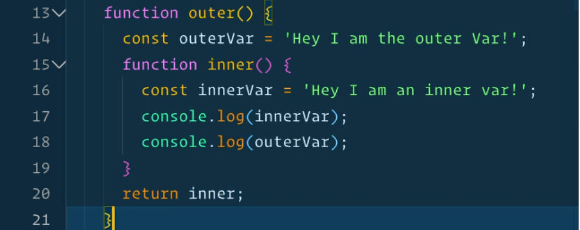

# Closures in JavaScript, Java and Python - Web Development Series (Part 3)

Last night, as I was doing ["Scope" in Wes Bos' JavaScript course](https://wesbos.com/courses), Wes introduced the concept of *a function returning a function*. I have been aware for quite some time that JavaScript allows this.



But what immediately stuck is it looks like *anonymous inner function* which I never batted an eye to while working in Java.

Ohh wait! Python [does it too](https://realpython.com/inner-functions-what-are-they-good-for/). No wonder, Python being more recent and community-developed, I can accept that concepts flow from one language into another.

Wait! He said "Closures". This gets interesting. And then I wonder - *Do recent versions of Java have Closures?*

Yes [indeed](https://www.geeksforgeeks.org/closures-in-java-with-examples/)! So almost all programming languages enable this concept which I broadly choose to refer to as "Closures" hereafter in this post. 

## What's so wonderful about closures?

They say the main point of closures is being able to access variables defined inside a function even after that function returns. Outright doesn't seem beneficial. After all, accessing something after its parent dies seems disastrous. Doesn't it? Well, then why are closures around?

````javascript
function outer(){
    const outerVar = 'I am an outerVar';
    function inner(){
        const innerVar = 'I am an innerVar';
        console.log(innerVar);
        console.log(outerVar);
    }
    return inner();
}
````

Here, the function `outer()` returns the function `inner()`. Since `inner()` is allowed access to `outerVar`, this in turn enables that behavior - the variable declared in a function that completed execution still exists.

However, this business of closures just to make local variables accessible outside their scope cannot be the only use case fo them. Right? Consider this

````javascript
function power(exponent){
    return function(base){
        return base**exponent;
    }
}

const square = power(2);
const cube = power(3); // Notice how convenient/readable the naming of functions becomes with closures!!

// Just a name to demonstrate. Not saying there is a 'main' function as in C, Java etc.
function main(){
    console.log(`Square of 10 is ${square(10)} and cube of 10 is ${cube(10)}`);
}
````

## How I ended up here? (The backstory)

I am on a journey to strengthen my understanding of Javascript and thereafter the Node and React ecosystem. My goal is to be a true functional programming developer rather than be a skeumorph fitting object-oriented/procedural styles into JavaScript.

With the goal to appreciate the niche functional programming specific ideas such as functions returning functions, arrow functions etc., I enrolled in https://beginnerjavascript.com/. Along the way I realize learning a new concept here makes me stop and think - 'How am I doing the equivalent in the other object-oriented languages day-to-day?' and sometimes makes me wonder 'Has this concept always been in those other languages and I am being behind not knowing it so far?'!

And so the series continues