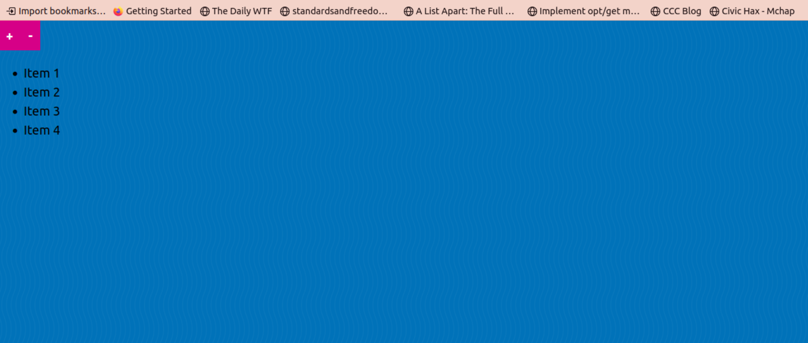

# Using closures to make a dynamic To-do list in Javascript - Web Development Series (Part 4)

Do you know the meme that everytime a developer sits down to do a side project, they go into this 'let me build a tool to make this part of the process and then a tool to make that tool and so where ultimately they end up building a To-Do List'? :)

In fact there's exactly [the site](https://todomvc.com/) that lets you try out building a To-Do list in different Javascript frameworks out there!

So what did I build as I just get my bearings with plain vanilla Javascript? A To-do List!!

## index.html

````html
<!DOCTYPE html>
<html lang="en">

<head>
  <meta charset="UTF-8">
  <meta name="viewport" content="width=device-width,initial-scale=1.0">
  <title>The DOM</title>
  <link rel="stylesheet" href="../../base.css">
</head>

<body>
    <!-- What are these styles doing here? If you paused here, it is your homework.. hihhihhi-->
  <style>
    img {
      transition: all 1s;
    }

    .round {
      border-radius: 50%;
    }
  </style>
  <script src="todo-list.js"></script>
</body>

</html>
````

## todo-list.js

````javascript
const list = document.createElement('ul');

const itemManager = () => {
  let index = 0;

  return {
    /**
     * Adds an item
     */
    add() {
      const listItem = document.createElement('li');
      listItem.textContent = `Item ${(index += 1)}`;

      list.append(listItem);

      document.body.append(list);
    },
    /**
     * Removes an item
     */
    remove() {
      const listItem = document.querySelector('li');

      listItem.remove();
    },
  };
};

const itemManagerInstance = itemManager();

// Add Button
const addButton = document.createElement('button');

addButton.innerHTML = `+`;
addButton.onclick = itemManagerInstance.add;

document.body.append(addButton);

// Remove Button
const removeButton = document.createElement('button');

removeButton.innerHTML = `-`;
removeButton.onclick = itemManagerInstance.remove;

document.body.append(removeButton);
````

## How to use?

I shared code for 2 files - index.html and todo-list.js. Copy the code lsitings into files named so and open the index.html in a browser! Both the files should be in the same directory. Here's how it looks: 
